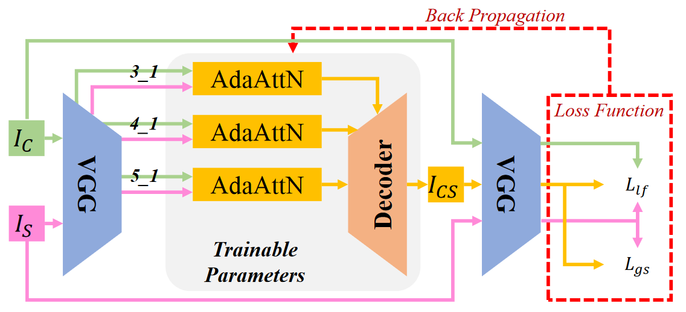
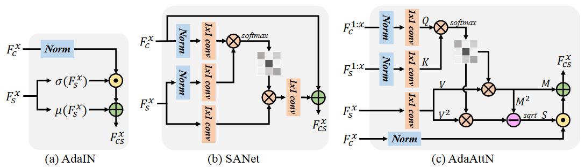

# AdaAttN: Revisit Attention Mechanism in Arbitrary Neural Style Transfer

[toc]



### *模型基础构建思路*

1. 取得两张图片$I_C$$I_S$,一张为内容图片，一张为风格图片
2. 将两张图片风别输入VGG模型提取各个层级的特征，
3. 选择$Relu_{3-1}, Relu_{4-1}, Relu_{5-1}$作为输入输入到$AdaAttN$中进行各个特征层级的融合
4. 将所得到的层级的融合的结果作为输入输入到$Decoder$中，这个$Decoder$ 具有和VGG相同的结构
5. 解码之后得到$I_{CS}$和原始图片，风格图片结合在一起输入到VGG分别提取三张的特征
6. 计算各个层级别的$loss$ 反向传播，调整$AdaAttN$ 和 $Decoder$ 的参数
7. 当经历若干个$epoch$ 之后暂停，将左侧的decoder部分作为图片的输出位置。

### *Adaptive Attention Normalization*

  

$F_c, F_s$ 作为从内容图片和风格图片中采集得到的信息。

#### AdaIN 单元

$$
\bold{AdaIN}(x, y) = \sigma (y) (\frac{x-\mu(x)}{\sigma (x)}) + \mu(y)
$$

$$
\mu_c (x) = \frac{1}{NHW}\sum_{n=1}^N\sum_{h=1}^H\sum_{w=1}^Wx_{nchw} \\

\sigma_c(x) = \sqrt{\frac{1}{NHW}\sum_{n=1}^N\sum_{h=1}^H\sum_{w=1}^W(x_{nchw}-\mu_c(x))^2 + \epsilon}
$$

可以发现均值其实就是全体像素的均值，属于全局特性

方差也是全局方差

通过两个变换，先把内容层标准化一下，随后与风格的方差进行点乘

随后加上均值。

*这不都是线性变化吗？？？？？为啥还能有效果*

##### *Batch Normalization*

$$
x\in R^{N\times C\times H\times W}\ \ \ 
BN(x) = \gamma(\frac{x - \mu(x)}{\sigma(x)}) + \beta
$$

上式中的$\gamma. \beta \in R^C$ 是待定的参数，需要从数据中学习，
$\mu(x), \sigma(x) \in R^C$ 是均值和标准差， 可以发现不同通道使用各自不同的标准差

```python
A = torch.randn(2, 3, 5, 5)
meanVal = A.mean(dim=(0, 2, 3)) # 消解维度
```

##### *Instance Normalization*

$$
\mathbf{IN}(x) = \gamma (\frac{x - \mu(x)}{\sigma(x)}) + \beta
$$

> 使用$IN\  layer$ 直接代替$BN\ layer$ 与BN不同的是

$$
\mu_{nc} = \frac{1}{HW} \sum_{h=1}^H\sum_{w=1}^Wx_{nchw} \\
\sigma_{nc} = \sqrt{\frac{1}{HW}\sum_{h=1}^H\sum_{w=1}^W(xnchw - \mu_{nc}(x))^2 + \epsilon}
$$

 所以削减的维度是宽高，而不考虑$Batch$ 和 $Channel$


可以明显发现$Instance Norm$ 下降的效果要好于$Batch Norm$

##### *Conditional Instance Normalization*

$$
\bold{CIN} (x;s) = \gamma^s(\frac{x - \mu(x)}{\sigma(x)}) + \beta^s
$$

与其给每一个风格练一个$\gamma, \beta$参数，不如直接给每个风格学习一个具体的参数集$\gamma^s, \beta^s$

在训练的时候，一个风格图片与其索引s，随机的从一个风格集中选择，内容图片随后被风格转换网络处理，

最终使得同一个网络可以生成完全不同的风格图片，

但是这种策略使得模型要训练的参数有一次增加了，不能够胜任实时转化的需求。

*对于每一张图的map mean求loss是不是也对于风格迁移有效*


1. 把图片输入到VGG中进行编码，
2. 提取中间某些层的数据输出到AdaIN中，进行编码，
3. 随后输入到Decoder中解码，得到一张风格图片
4. 计算生成的图片与AdaIN编码后图片的*loss*
5. 计算生成的图片与风格图片的*loss*
6. 回归，更新AdaIN，和Decoder的参数

模型训练的是decoder，所以只需要把decoder训练好了之后，就可以抛开最后一步，直接得到风格图片。

​	

##### Methods

* [x] AdaIN Unit
* [ ] Decoder (like Vgg)  直接拿比较鲜明的几层作为编码器（预计花费时间2天） 上下采样，卷积是什么意思？
* [x] Content Loss, Style loss (使用均值与方差作为风格损失)


##### Implement

`decoder`中只能允许一个输入，`AdaIN`单元并不会改变数据的维度，

数据输入之后，编码为一个个特征，或者一张`feature map`

随后编码为`AdaIN`, 输入到`decoder`中

解码得到一张新的图片，再进入编码模型中，计算`LOSS`

1. 不允许自定义字段
2. 限制解码器的输出维度
3. 将所得的图片输入到`VGG`中
4. 编码计算下降`LOSS` 


为什么LeonA的模型可以，而我的不行？


LeonA模型行的原因：

contentLoss 直接返回了，content只起记录的作用

未使用self留下，在主函数里迭代调用


#### *SANet 单元*


